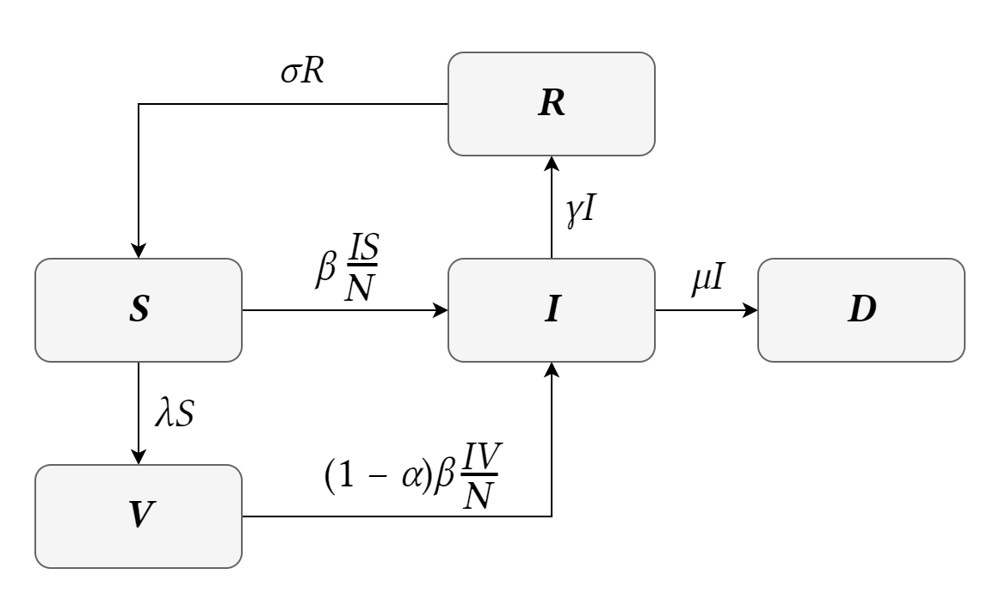

# A Mathematical Model of a Pandemic
This project's aim is to model the progression of a pandemic in a population given certain initial parameters. In order to accomplish this, a basic SIR model[^1] was used to construct a new mathematical model that is able to model the pandemic's progression with some accuracy. The model is by default based on mathematical models that have been used to model the COVID-19 pandemic, although the modularity of its parameters allow it to be used as a general model.

## Model

The **SIRDV model** (_Susceptible-Infected-Recovered-Deceased-Vaccinated_) divides the total population _N_ into following compartments:
* Susceptible compartment,
* Infected compartment,
* Recovered compartment,
* Deceased compartment,
* Vaccinated compartment.

The transmission of people from susceptible compartment into infected compartment is determined by the rate of infection _β_, which can be reduced by employing face coverings or lockdown measures by certain part of the popluation, thus reducing the number of infections. The maximum effectiveness of mask use and lockdown measures was determined as the result of studies on the effectiveness of these measures in the case of the COVID-19 pandemic: face masks amount to 50% reduction in effective transmission, while lockdown measures to 85%.[^2]

For simplicity no non-pandemic demographic impact was assumed, i.e. the birth rate is equal to the non-pandemic death rate.

By setting certain parameters to zero, it is possible to simplify the model by generating a subset of the initial SIRDV model: by setting the vaccination rate to 0, one arrives at an SIRD model; by setting the mortality rate to 0, one arrives at an SIRV model, and so on.

## References
[^1]: I. Cooper, A. Mondal and C. G. Anthonopoulos, "A SIR model assumption for the spread of COVID-19 in different communities", _Chaos, Solitons & Fractals_, vol. 139, 2020.
[^2]: S. Talic, S. Shah, H. Wild, D. Gasevic, A. Maharaj, Z. Ademi, X. Li, W. Xu, I. Mesa-Eguiagaray, J. Rostron, E. Theodoratou, X. Zhang, A. Motee, D. Liew and D. Ilic, "Effectiveness of public health measures in reducing the incidence of covid-19, SARS-CoV-2 transmission, and covid-19 mortality: systematic review and meta-analysis," _BMJ_, vol. 375, 2021.
